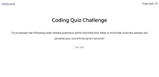

# 04 Web APIs: Code Quiz
<h1>Description</h1>
This application is a timed code quiz with multiple-choice questions, using JavaScript and Jquery fundamentals. 

<h1>Usage</h2>
<h3>When the user clicks the Start button:</h3>
<ol>
<li>A timer starts counting down from 75 seconds</li>
<li>They are prompted to answer the first of 5 possible quiz questions</li>
<li>After they select the button of their chosen answer, the next answer appears. The correct/wrong status of their last answer appears below the question momentarily before fading out. If they answer incorrectly, 15 seconds is deducted from the timer</li>
<li>The quiz ends when either all questions are answered, or when the timer reaches zero</li>
</ol>

<h3>When the quiz is finished:</h3>
<ol>
<li>The total score is displayed. 10 points per correct question are awarded.</li>
<li>The user is prompted to enter their initials, for their score to be added to the high scores page</li>
<li>The Highscores pages is displayed, including their recent score.</li>
<li>The user can click buttons to either Go Back to the start of the quiz to take it again, or to Clear Highscores</li>
<li>If playing again, the user is able to click the Highscores link at the top of the screen to view previous highscores
</ol>

<h3>The following animation demonstrates the application functionality:</h3>

